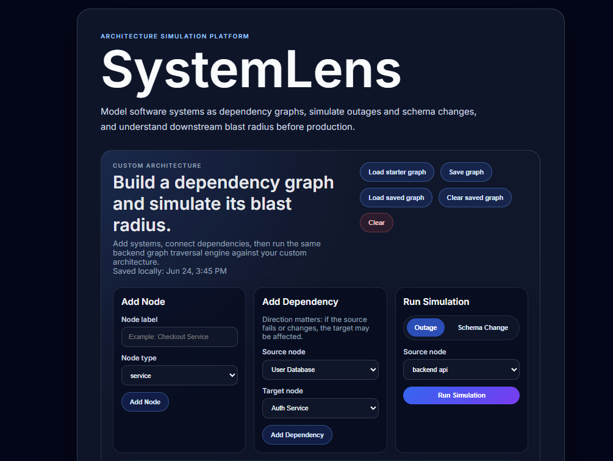
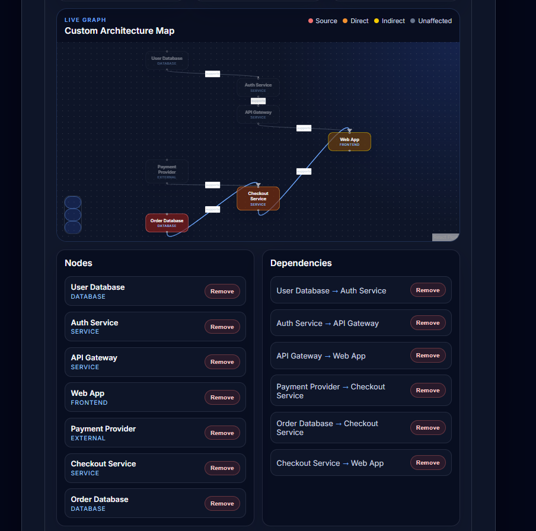
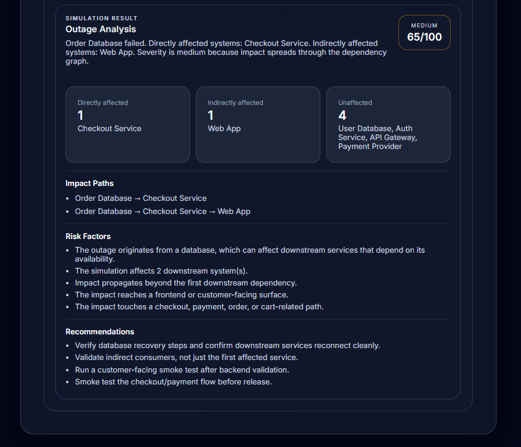

# SystemLens

SystemLens is a full-stack architecture impact simulator that helps developers understand how outages and schema changes propagate through software systems.

Users can model an architecture as a dependency graph, run outage or schema-change simulations, visualize downstream blast radius, and generate deployment risk reports with recommended validation steps.

## Demo

### Custom Architecture Builder



### Blast Radius Visualization



### Risk Assessment Report



## Why I Built This

Modern software systems are interconnected. A database outage, external provider failure, or backend contract change can affect services and customer-facing flows in ways that are not always obvious.

SystemLens was built to make those dependencies visible.

The goal is to help developers answer questions like:

- What systems are directly affected if this component fails?
- What systems are indirectly affected through dependency chains?
- Does this change reach a customer-facing surface?
- What should be validated before deploying or recovering?

## Features

- Build custom architecture dependency graphs
- Save and load custom architectures
- Add systems such as services, databases, frontends, queues, workers, and external providers
- Define directional dependencies between systems
- Run outage simulations
- Run schema-change simulations
- Visualize direct and indirect blast radius on a live graph
- Generate impact paths through the architecture
- Identify unaffected systems
- Calculate deployment risk level and risk score
- Provide risk factors and validation recommendations
- Load a starter architecture for quick demos

## Tech Stack

### Frontend

- React
- TypeScript
- Vite
- React Flow / XYFlow
- CSS

### Backend

- Java
- Spring Boot
- Maven
- REST API

## How It Works

SystemLens represents software architecture as a directed graph.

Each node represents a system component, such as a service, database, frontend, queue, worker, or external provider.

Each edge represents a dependency relationship:

```text
Source system → Dependent system
```

If the source system fails or changes, the dependent system may be affected.

When a simulation runs, the backend traverses the graph to calculate:

- Directly affected systems
- Indirectly affected systems
- Unaffected systems
- Impact paths
- Severity
- Deployment risk assessment

### Example Architecture

The starter graph includes multiple dependency paths:
``` bash
User Database → Auth Service → API Gateway → Web App

Payment Provider → Checkout Service → Web App

Order Database → Checkout Service → Web App
```

Example outage:
```bash
Order Database fails
```
SystemLens identifies:
```bash
Directly affected:
Checkout Service

Indirectly affected:
Web App

Unaffected:
User Database, Auth Service, API Gateway, Payment Provider
```

### Risk Assessment

SystemLens generates a deployment readiness report after each simulation.

The risk assessment considers factors such as:

- Number of affected downstream systems
- Length of the longest impact path
- Whether the impact reaches a frontend or customer-facing surface
- Whether checkout, payment, order, or cart-related flows are affected
- Whether the source is a database or external provider
- Whether the simulation is an outage or schema-change scenario

Example recommendations include:

- Verify database recovery steps
- Validate indirect consumers
- Run customer-facing smoke tests
- Smoke test checkout and payment flows
- Run integration tests for changed contracts
### API Endpoints
**Health**
``` bash
GET /api/health
```
**Sample Architecture**
```bash
GET /api/simulations/sample/nodes
GET /api/simulations/sample/graph
```
**Sample Simulation Analysis**
```bash 
POST /api/simulations/outage/analyze
POST /api/simulations/schema-change/analyze
```
**Custom Architecture Simulation Analysis**
```bash
POST /api/simulations/outage/custom/analyze
POST /api/simulations/schema-change/custom/analyze
```
Custom Outage Request Example
```bash
{
  "nodes": [
    {
      "id": "order-database",
      "label": "Order Database",
      "type": "database"
    },
    {
      "id": "checkout-service",
      "label": "Checkout Service",
      "type": "service"
    },
    {
      "id": "web-app",
      "label": "Web App",
      "type": "frontend"
    }
  ],
  "edges": [
    {
      "id": "edge-order-database-checkout-service",
      "sourceNode": "Order Database",
      "targetNode": "Checkout Service",
      "relationship": "supports"
    },
    {
      "id": "edge-checkout-service-web-app",
      "sourceNode": "Checkout Service",
      "targetNode": "Web App",
      "relationship": "supports"
    }
  ],
  "failedNode": "Order Database"
}
```
**Example Response**
```bash
{
  "simulation": {
    "failedNode": "Order Database",
    "severity": "medium",
    "directlyAffected": ["Checkout Service"],
    "indirectlyAffected": ["Web App"],
    "unaffected": [],
    "impactPaths": [
      ["Order Database", "Checkout Service"],
      ["Order Database", "Checkout Service", "Web App"]
    ],
    "explanation": "Order Database failed. Directly affected systems: Checkout Service. Indirectly affected systems: Web App. Severity is medium because impact spreads through the dependency graph."
  },
  "riskAssessment": {
    "riskScore": 65,
    "riskLevel": "medium",
    "riskFactors": [
      "The outage originates from a database, which can affect downstream services that depend on its availability.",
      "The simulation affects 2 downstream system(s).",
      "Impact propagates beyond the first downstream dependency.",
      "The impact reaches a frontend or customer-facing surface.",
      "The impact touches a checkout, payment, order, or cart-related path."
    ],
    "recommendations": [
      "Verify database recovery steps and confirm downstream services reconnect cleanly.",
      "Validate indirect consumers, not just the first affected service.",
      "Run a customer-facing smoke test after backend validation.",
      "Smoke test the checkout/payment flow before release."
    ]
  }
}
```
### Running Locally
**Backend**

From the backend directory:
```bash
cd backend
./mvnw spring-boot:run
```
On Windows PowerShell:
```bash
cd backend
.\mvnw.cmd spring-boot:run
```
The backend runs on:
```bash
http://localhost:8080
```
**Frontend**

From the frontend directory:
```bash
cd frontend
npm install
npm run dev
```
The frontend runs on the Vite development URL shown in the terminal, usually:
```bash
http://localhost:5173
```
### Project Structure
```bash
reposcope/
  backend/
    src/main/java/com/reposcope/backend/
      controller/
      dto/
      engine/
      model/
      sample/
      service/
  frontend/
    src/
      api/
      components/
      types.ts
      App.tsx
```
### Current Status

SystemLens currently supports:

- Custom user-defined architecture graphs
- Live graph visualization
- Outage simulation
- Schema-change simulation
- Blast-radius highlighting
- Risk scoring
- Risk factor generation
- Validation recommendations
### Future Improvements

Possible future improvements include:

- Export simulation reports
- Compare two simulation scenarios
- Add more starter architecture templates
- Add backend tests for graph traversal and risk scoring
- Deploy the frontend and backend
### What This Project Demonstrates

SystemLens demonstrates:

- Full-stack application development
- REST API design
- Graph traversal logic
- Type-safe frontend development with TypeScript
- Interactive architecture visualization
- Backend risk-analysis logic
- Product-oriented engineering and developer-tool design
